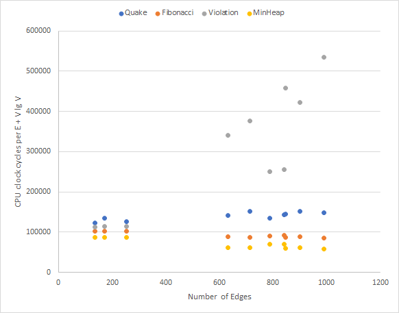

# Comparison of Priority Heaps for Dijkstra's Shortest Path Algorithm

[Mrinal Ghosh](https://github.com/mrinalghosh), [Amanda Justiniano-Pagan](https://github.com/amjustin13), [Camden Kronhaus](https://github.com/camdenkr), [Panat Taranat](https://github.com/ptaranat)

## Abstract

This project aims to benchmark four alternate priority queue algorithms: quake heaps, Fibonacci heaps, rank-pairing heaps, min heaps and violation heaps. Our priority heap implementations were integrated into a Dijkstra shortest path algorithm using decrease_key(). The NetworkX library was used for the creation, analysis, manipulation of graphs and networks. Timing for Dijkstra running with each heap on a variety of graphs randomly generated with varying properties.

We will use the NetworkX library for the creation, analysis, manipulation of graphs and networks. Using NetworkX will allow us to visualize graphs using Matplotlib, and generate random small and large connected, undirected graphs represented as NetworkX graph classes. Additionally, we will write unit tests using Pytest (modular regression testing framework) to ensure correctness of the priority queue implementations as well as the path-finding algorithm.

The data used to benchmark the heaps will be split among sparse and dense graphs that  are randomly generated. Benchmarking will be done amongst the heap implementations as well as a vanilla min-heap. Clock time and CPU cycles will be the primary metrics of performance, and will be gathered and plotted against graph size using Matplotlib.

## Instructions

### Contents

The project files are the following:

- [main.py](main.py): Runs a dijkstra algorithm for each of the heap implementations with a provided graph (json format) in test_graphs. Output information is displayed on the console and stored in two files:
   - report.csv: Contains graph information, avg execution time, avg clock cycles
   - paths.csv: Contains shortest paths in order of node visited. All heap variations should output the same paths for the same graphs.

- [requirements.txt](requirements.txt): Requirements file containing all the pip packages required to run the project

- [graph_generator.py](test_graphs/graph_generator.py): Script containing utility and plotting functions for graph generation.

- [fibonacci.py](./heaps/fibonacci.py): Fibonacci heap implementation 
- [quake.py](./heaps/quake.py): Quake heap implementation 
- [violation.py](./heaps/violation.py): Violation heap implementation 

- [Heap unit tests](tests): Unit testing framework using pytest for each heap implementation

- [Test graphs](test_graphs): Randomly generated graphs with varying degrees of connectedness. Each graph is represented in a json format adjacency list and written to file on creation. 

### Execution

Install Python requirements:
```shell
python3 -m pip install -r requirements.txt
```
Run the `main.py` file, which will run the benchmark tests on the graphs inside the `test_graphs` folder:
```shell
python3 ./main.py
```
To run our graph generation helper functions, from a separate python script you can run the following:
```shell
import from test_graphs.graph_generator import *
graph_num = 20

# graph_list is a list of Networkx graph objects
graph_list = generate_graphs(graph_num)

# If no .json file is specified, this will pull any files
# within test_graphs/ folder
graph_list = get_graphs_from_file(path_to_file)
```
To run unit tests, execute `pytest` in the same directory as `main.py` and `tests` folder.

## Sample Results
```csv
# report.csv
Quake
num_nodes,num_edges,avg_time,avg_cycles
120,789,0.05961108207702637,226079683
125,841,0.0674893856048584,255961983
151,633,0.06519428888956706,247255423
169,714,0.08049201965332031,305277851
17,136,0.006867170333862305,26035637
196,901,0.10150400797526042,384973427
19,171,0.009065469106038412,34372127
205,846,0.09414839744567871,357073232
238,989,0.11629573504130046,441075943
23,253,0.012003421783447266,45513740

Fibonacci
num_nodes,num_edges,avg_time,avg_cycles
120,789,0.0401762326558431,152362951
125,841,0.04210575421651205,159684284
151,633,0.042828003565470375,162422830
169,714,0.04613653818766276,174971722
17,136,0.0056459903717041016,21402512
196,901,0.05621210734049479,213187410
19,171,0.007032314936319987,26661788
205,846,0.05611228942871094,212809779
238,989,0.06574026743570964,249328349
23,253,0.009707212448120117,36805166

Violation
num_nodes,num_edges,avg_time,avg_cycles
120,789,0.10897246996561687,413303985
125,841,0.1162737210591634,440994484
151,633,0.1577295462290446,598233232
169,714,0.19857056935628256,753138948
17,136,0.006237427393595378,23647109
196,901,0.26895610491434735,1020104439
19,171,0.007915576299031576,30006383
205,846,0.2952055136362712,1119665085
238,989,0.41097362836201984,1558760823
23,253,0.011033376057942709,41834491

MinHeap
num_nodes,num_edges,avg_time,avg_cycles
120,789,0.030773242314656574,116701686
125,841,0.03214764595031738,121913386
151,633,0.028430700302124023,107817945
169,714,0.03328259785970052,126216949
17,136,0.004799048105875651,18191043
196,901,0.03978546460469564,150883560
19,171,0.005913257598876953,22417999
205,846,0.03913418451944987,148412851
238,989,0.04596892992655436,174337097
23,253,0.00844558080037435,32017774
```
```csv
# paths.csv
Quake
56,40,65,23,107,62
83,66,26,12,93,10,86
10,119,125,144,130,150,110,61,146,122
2,94,27,23,143,152,139
7,5,12,10
42,46,109,166,190,132
4,1,0,10,5,2,12
7,84,110,66,81,197,89,191
220,198,159,51,49,62,105,68,222
0,10,12

Fibonacci
56,40,65,23,107,62
83,66,26,12,93,10,86
10,119,125,144,130,150,110,61,146,122
2,94,27,23,143,152,139
7,5,12,10
42,46,109,166,190,132
4,1,0,10,5,2,12
7,84,110,66,81,197,89,191
220,198,159,51,49,62,105,68,222
0,10,12

Violation
56,40,65,23,107,62
83,66,26,12,93,10,86
10,119,125,144,130,150,110,61,146,122
2,94,27,23,143,152,139
7,5,12,10
42,46,109,166,190,132
4,1,0,10,5,2,12
7,84,110,66,81,197,89,191
220,198,159,51,49,62,105,68,222
0,10,12

MinHeap
56,40,65,23,107,62
83,66,26,12,93,10,86
10,119,125,144,130,150,110,61,146,122
2,94,27,23,143,152,139
7,5,12,10
42,46,109,166,190,132
4,1,0,10,5,2,12
7,84,110,66,81,197,89,191
220,198,159,51,49,62,105,68,222
0,10,12
```



## References
Quake Heaps
- http://www.eecs.tufts.edu/~aloupis/comp150/classnotes/Quake-heap.pdf 
- https://tmc.web.engr.illinois.edu/heap_ianfest.pdf 

Violation Heaps
- https://violationheap.weebly.com/
- https://arxiv.org/pdf/0812.2851.pdf
- https://github.com/haoliangx/Violation-Heap

Fibonacci Heaps
- https://www.programiz.com/dsa/fibonacci-heap
- https://rosettacode.org/wiki/Fibonacci_heap#Python

Rank-Pairing Heaps
- https://www.cs.princeton.edu/courses/archive/spr10/cos423/handouts/rankpairingheaps.pdf
- https://skycocoo.github.io/Rank-Pairing-Heap
- https://www.microsoft.com/en-us/research/publication/rank-pairing-heaps-2
